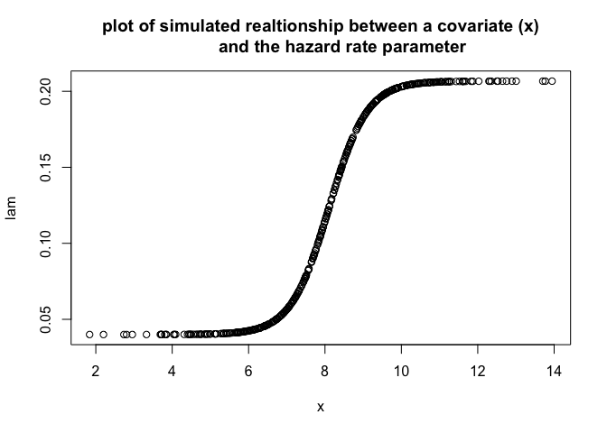
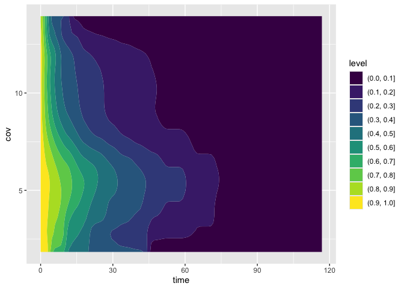
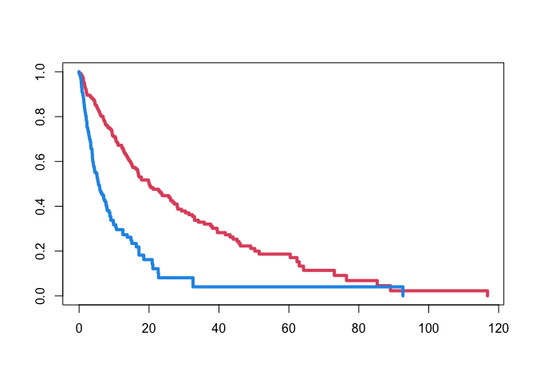

<!-- README.md is generated from README.Rmd. Please edit that file -->

## Didi Plots: An introduction

This gives a basic example of how to use the ‘Didi’ estimator to
visualise the impact of continuous covariates on time-to-event outcomes

## Simulated data

Three covariates are required which are simulated for N=500 observations
using rnorm(N, 8,2). We then generate a hazard parameter based on a the
following sigmoid formula:

h = 0.04 + 1/(6+exp(-a(x-b)))

with parametes a=2 and b=9 used. Based on this we generate survival time
data from an exponential distribution with hazard parameter h. A basic
censoring indicator is generated using ’rbinom(N,1,0.7)\`

``` r
  set.seed(041084)
  N <- 500
  x <- rnorm(N,8,2)
  
  a <- 2
  b <- 9
  lam <- 0.04 + 1/(6+exp(-a*(x-b)))
  st <- rexp(N,lam)
  cen <- rbinom(N,1,0.55)

  plot(x,lam,main="plot of simulated realtionship between a covariate (x)
         and the hazard rate parameter")
```



## Calculate the double weighted kernel (Didi) estimator

``` r
plot.didi(didi)
```



## Example

To get an idea of how this compares to a standard Kaplan Meir plot we
can dichotomise ‘x’

``` r

xn <- cut(x,c(0,8,Inf),c("low","high"));table(xn)
#> xn
#>  low high 
#>  238  262
sfit <- survfit(Surv(st,cen)~xn)
plot(sfit,col=c(2,4),lwd=4)
```



## Details

Find code at: <https://github.com/richJJackson/didi>

## Reference

Jackson RJ, Cox TF. Kernel hazard estimation for visualisation of the
effect of a continuous covariate on time‐to‐event endpoints.
Pharmaceutical Statistics. 2022 May;21(3):514-24.
